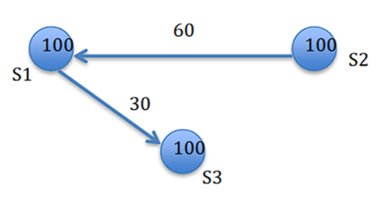

# COMS 552 HW3

## Problem 1 Causal ordering of messages [25pts]

Show how to apply the Birman-Schipter-Stephenson Protocol to following
scenario to assure causal ordering of messages. Provide the details of each
message: sender, sending timestamp, receiver, and delivery timestamp. (Let M1
and M2 denote the first message sent from P3 to P1 and P2 respectively, and M3
and M4 denote the second message sent from P3 to P1 and P2 respectively.)

- Initial state: $VT_1 = [0,0,0], VT_2 = [0,0,0], VT_3 = [0,0,0]$ for $P_1, P_2, P_3$ respectively
- Now we follow the steps for Birman-Schipter-Stephenson Protocol
- Message M1 and M2 (First Broadcast from P3)
    - P3 increments $VT_3[3] \Rightarrow VT_3 = [0,0,1]$
    - The message is then broadcast with timestamp [0,0,1]
    - M1: Sender = P3, Sending timestamp = [0,0,1], Receiver = P1
    - M2: Sender = P3, Sending timestamp = [0,0,1], Receiver = P2
- Message M3 and M4 (Second Broadcast from P3)
    - P3 increments $VT_3[3] \Rightarrow VT_3 = [0,0,2]$
    - The message is then broadcast with timestamp [0,0,2]
    - M3: Sender = P3, Sending timestamp = [0,0,2], Receiver = P1
    - M4: Sender = P3, Sending timestamp = [0,0,2], Receiver = P2
- Now we look at the arrival and delivery order
    - M3 arrives at P1 first:
        - We check the conditions:
            - $VT_1[3] = 0$ and $VT_{M3}[3] - 1 = 2 - 1 = 1$ so the condition does not hold
            - So M3 is buffered (P1 hasn't received the previous message M1 from P3 yet)
    - M1 arrives at P1:
        - We check the conditions:
            - $VT_1[3] = 0$ and $VT_{M1}[3] - 1 = 0$ so this holds
            - $VT_1[1] \geq VT_{M1}[1] \Rightarrow 0 \geq 0$ so this holds
            - $VT_1[2] \geq VT_{M1}[2] \Rightarrow 0 \geq 0$ so this holds
        - Since both conditions hold, M1 is delivered immediately
        - Delivery timestamp: [0,0,1]
        - After delivery: $VT_1[k] = max\{VT_1[k], VT_{M1}[k]\}$ for all k
            - So $VT_1 = [max(0, 0), max(0, 0), max(0,1)] = [0, 0, 1]$
    - Since M1 was delivered we check buffered M3 at P1
        - We check the conditions:
            - $VT_1[3] = 1$ and $VT_{M3}[3] - 1 = 1$ so this holds
            - $VT_1[1] \geq VT_{M3}[1] \Rightarrow 0 \geq 0$ so this holds
            - $VT_1[2] \geq VT_{M3}[2] \Rightarrow 0 \geq 0$ so this holds 
        - Since both conditions hold, M3 is delivered now
        - Delivery timestamp: [0,0,2]
        - After delivery: $VT_1[k] = max\{VT_1[k], VT_{M3}[k]\}$ for all k
            - So $VT_1 = [max(0, 0), max(0, 0), max(2, 1)] = [0, 0, 2]$
    - M4 arrives at P2:
        - We check the conditions:
            - $VT_2[3] = 0$ and $VT_{M2}[3] - 1 = 2 - 1 = 1$ so the condition does not hold
            - So M4 is buffered (P2 hasn't received M2 yet)
    - M2 arrives at P2:
        - We check the conditions:
            - $VT_2[3] = 0$ and $VT_{M2}[3] - 1 = 0$ so this holds
            - $VT_2[1] \geq VT_{M2}[1] \Rightarrow 0 \geq 0$ so this holds
            - $VT_2[2] \geq VT_{M2}[2] \Rightarrow 0 \geq 0$ so this holds
        - Since both conditions hold, M2 is delivered immediately
        - Delivery timestamp: [0,0,1]
        - After delivery: $VT_2[k] = max\{VT_2[k], VT_{M2}[k]\}$ for all k
            - So $VT_2 = [max(0, 0), max(0, 0), max(0,1)] = [0, 0, 1]$
    - Since M2 was delivered we check buffered M4 at P2
        - We check the conditions:
            - $VT_2[3] = 1$ and $VT_{M4}[3] - 1 = 2 - 1 = 1$ so this holds
            - $VT_2[1] \geq VT_{M4}[1] \Rightarrow 0 \geq 0$ so this holds
            - $VT_2[2] \geq VT_{M4}[2] \Rightarrow 0 \geq 0$ so this holds 
        - Since both conditions hold, M4 is delivered now
        - Delivery timestamp: [0,0,2]
        - After delivery: $VT_2[k] = max\{VT_2[k], VT_{M4}[k]\}$ for all k
            - So $VT_2 = [max(0, 0), max(0, 0), max(1, 2)] = [0, 0, 2]$
- Therfore we have determined the causal ordering of messages using Birman-Schipter-Stephenson Protocol

## Problem 2 Global State Recording [25pts]

Suppose the Chandy-Lamport’s global state recording algorithm is started by
site S1 (i.e., S1 is the first who records its local state) at the moment shown
below, what will be the global state (including both local states and channels)
recorded? Here we assume any two sites can communicate with each other.

- Initial State
    - S1 = 100 (start)
    - S2 = 100
    - S3 = 100
- S1 initiates the recording
    - S1 records its local state to be LS1 = 100
    - Sending markers on all outgoing channels
        - Sends marker on channel C(S1 -> S2)
        - Sends marker on channel C(S1 -> S3)
- S2 receives marker from S1
    - S2 hasn't recorded its state yet
    - So we:
        - Record C(S1 -> S2) as empty
        - S2 records its local state to be LS2 = 100
        - Send markers on all outgoing channels
            - Sends marker on channel C(S2 -> S1)
            - Sends marker on channel C(S2 -> S3)
- S3 receives marker from S1
    - S3 hasn't recorded its state yet
    - C(S1 -> S3) already contains 30
    - Based on FIFO, S3 receives this values first
    - S3 records its local state to be LS3 = 130
    - Now we:
        - Record C(S1 -> S3) as empty
        - Send markers on all outgoing channels
            - Sends marker on channel C(S3 -> S1)
            - Sends marker on channel C(S3 -> S2)
- S1 receives marker from S2
    - S1 has already recorded its state
    - Therefore we:
        - Record the state of C(S2 -> S1) as all messages received after S1's state was recorded and before receiving this marker
        - This would be the message 60
        - C(S2 -> S1) = \{60\}
- Handling Remaining Markers
    - S2 receives marker from S3: C(S3 -> S2) is recorded as empty
    - S3 receives marker from S2: C(S2 -> S3) is recorded as empty
    - S1 receives marker from S3: C(S3 -> S1) is recorded as empty
- Final Global State
    - GS = \{LS1 = 100, LS2 = 100, LS3 = 130 \}
    - Channel states
        - C(S1 -> S2) = \{\}
        - C(S1 -> S3) = \{\}
        - C(S2 -> S1) = \{60\}
        - C(S2 -> S3) = \{\}
        - C(S3 -> S1) = \{\}
        - C(S3 -> S2) = \{\}

## Problem 3 Distributed Commit Protocols [20pts]

Recall the 2-phase and 3-phase commit protocols, and answer the following
question: Consider a system with 7 processes (1 coordinator and 6 participants).
Provide an example to show that, for some failure scenario where the coordinator
cannot be reached by some sites, the 2-phase commit protocol blocks such sites
until the coordinator becomes reachable again while the 3-phase commit protocol
does not.

- Consider the following failure scenario
    - There is one coordinator C
    - There are 6 participants P1, P2, P3, P4, P5, P6
    - P1, P2, P3 can reach C but P4, P5, P6 cannot reach C
- 2-phase commit scenario: Blocking occurs
    - Voting
        - Coordinator sends VOTE_REQUEST to all 6 participants
        - All participants P1, P2, P3, P4, P5, P6 receive the request and VOTE_COMMIT
        - P1, P2, P3 sends their votes back to C
        - Failure scenario occurs
        - P4, P5, P6 vote VOTE_COMMIT but can't send their votes to C since it is unreachable
    - Decision
        - C receives votes from P1, P2, P3
        - C is waiting for votes from P4, P5, P6 but these processes can't reach C
        - So C times out and sends GLOBAL_ABORT to P1, P2, P3, the processes that are reachable
        - P1, P2, P3 receive the GLOBAL_ABORT and aborts
    - Issue
        - P4, P5, P6 are all in the READY state
        - They voted COMMIT but the coordinator never received this info
        - So P4, P5, P6 cannot reach C to receive the GLOBAL_ABORT
        - They must wait indefinitely or timeout for C to become reachable
        - Even if they do timeout, they can't reach C to determine what decision was made
    - So P4, P5, P6 are blocked indefinitely
- 3-phase commit scenario: Blocking doesn't occur
    - Voting
        - Similar scenario as 2-phase
        - Coordinator sends VOTE_REQUEST to all 6 participants
        - All participants P1, P2, P3, P4, P5, P6 receive the request and VOTE_COMMIT
        - P1, P2, P3 sends their votes back to C
        - Failure scenario occurs
        - P4, P5, P6 vote VOTE_COMMIT but can't send their votes to C since it is unreachable
    - Prepare to commit
        - C receives votes from P1, P2, P3
        - C sends PREPARE_COMMIT to P1, P2, P3
        - P1, P2, P3 enter the PRECOMMIT state
        - P4, P5, P6 can't receive PREPARE_COMMIT from C
    - Decision
        - C sends GLOBAL_COMMIT to P1, P2, P3 and they commit
        - P4, P5, P6 timeout waiting for PREPARE_COMMIT
        - P4, P5, P6 are still in the READY state and run the majority rule to make a decision
        - P4, P5, P6 contact each other, forming a majority since these are all of the reachable processes
        - They are all in the READY state
        - Since P1, P2, P3 form a majority, and none of them are in PRECOMMIT, we abort
    - So we see that in our case, there is not blocking with 3-phase

## Problem 4 Agreement in Byzantine faulty system [30pts]

Consider the Byzantine generals problem where the number of generals is N=7 and
among them the number of the traitors is no greater than m=2. Assume two
lieutenants (denoted as L1 and L2) are traitors while the commander and all other
lieutenants are loyal; the commander’s order is “Attack”; a traitor lieutenant sends
“Attack” or “Retreat” arbitrarily (you can arbitrarily determine what it will send).
Describe how the agreement algorithm (with oral messages) is run among the
generals by specifying what messages (i.e., “Attack” or “Retreat”) are sent in each
step of the algorithm (when some steps are similar, you can avoid repetition by just
saying they are similar) and how the majority function is used to make decision.

